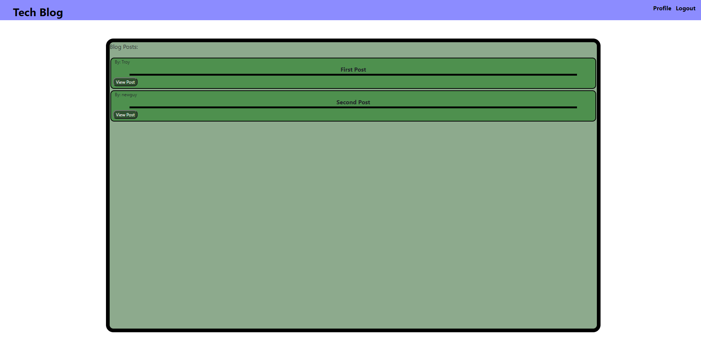

# Troy's Tech Blog

## Developed By: Troy Grossi

Deployed: https://troystechblog.herokuapp.com/

 
 

# Description

A blog website that keeps track of and displays users posts and comments.

# Table of Contents

- [Installation](#installation)

- [Usage](#usage)

- [Contribution](#contribution)

- [License](#license)

<!---->

- [Questions](#questions)

# Installation

Download the project from github. Must have node, mysql, and npm downloaded on your client. Type "npm install" in the terminal from the root of this project to download the dependencies. You then must create a .env file that corresponds with the variables DB_NAME, DB_USER, and DB_PW. Next, type "mysql -u root -p"in the terminal to open the mysql terminal. From within the mysql terminal, type "source db/schema.sql" to link the database with mysql. From here everything will be up and running.

- Dependencies: node, express, express-handlebars, express-session, mysql2, sequelize, connect-session-sequelize, mbd, mdb, jquery, dotenv, bootstrap

# Usage

- From the main page, click the view posts button to view the post content, such as the author's content and the other user's comments
- Sign-up to create a profile
- When logged in, the user can create their own posts and comment on other's posts, and they have acces to their profile page
- Navigate to your profile to view your saved posts and comments
- Delete posts and comments from the profile page
- Navigate to your posts or comments by clicking the view post button
- Log-out to exit your profile
- Log-in with your credentials to eneter your profile

<!---->

Screenshot:

<!---->

# Contribution

Refer to:
[Contribution Convenant](https://www.contributor-covenant.org/version/2/0/code_of_conduct/code_of_conduct.md)

# License

MIT

# Questions

Ask questions at my github

- GitHub Link: https://github.com/troygrossi/Blog-Website
